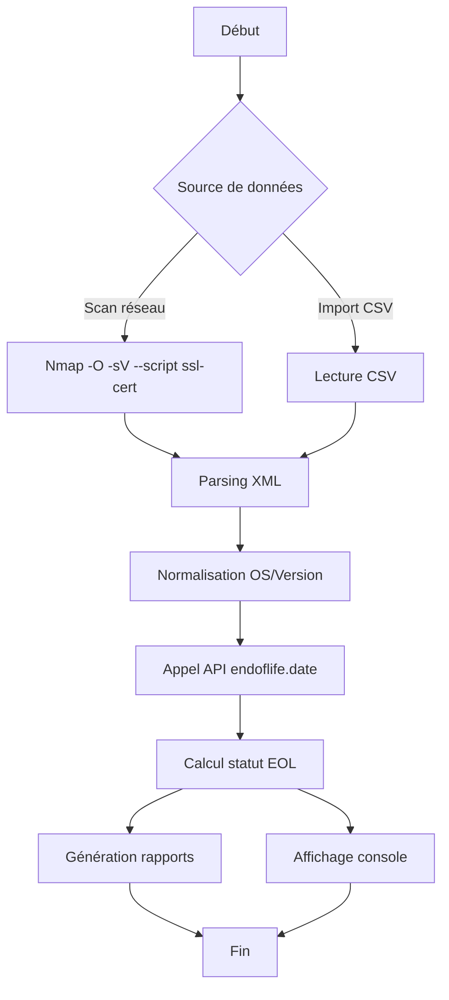

# 🔍 Module d'Audit d'Obsolescence Réseau

<div align="center">


*Un outil puissant pour auditer l'obsolescence des systèmes d'exploitation de votre parc réseau*

[Fonctionnalités](#-fonctionnalités) • [Installation](#-installation) • [Utilisation](#-utilisation) • [Documentation](#-documentation)

</div>

---

## 📋 Table des matières

- [Vue d'ensemble](#-vue-densemble)
- [Fonctionnalités](#-fonctionnalités)
- [Prérequis](#-prérequis)
- [Installation](#-installation)
- [Utilisation](#-utilisation)
- [Architecture](#-architecture)
- [Limitations](#-limitations)
- [Exemples de rapports](#-exemples-de-rapports)
- [Roadmap](#-roadmap)
- [Contribution](#-contribution)
- [Licence](#-licence)

---

## 🎯 Vue d'ensemble

Ce script Python réalise un **audit complet d'obsolescence** des systèmes d'exploitation détectés sur un réseau, en combinant :

- 🔎 **Scan réseau** avec Nmap pour la découverte et l'identification des OS
- 📅 **Vérification EOL** via l'API [endoflife.date](https://endoflife.date)
- 📊 **Génération de rapports** multiformats (CSV, JSON, HTML)

### Pourquoi ce projet ?

Dans un environnement IT, maintenir à jour l'inventaire des systèmes et connaître leur statut de support est **crucial pour la sécurité** et la conformité. Ce module automatise cette tâche fastidieuse et fournit des rapports exploitables pour les équipes infrastructure et sécurité.

---

## ✨ Fonctionnalités

### 🔍 Découverte réseau avancée

- Scan automatisé d'une plage IP avec **Nmap**
- Détection OS avec empreintes avancées (`-O`, `-sV`, `--osscan-guess`)
- Extraction du **Common Name** des certificats SSL
- Support des OS : Windows Desktop, Windows Server, Ubuntu, Debian, Linux générique

### 📅 Vérification d'obsolescence

- Interrogation de l'API **endoflife.date** pour les dates EOL
- Cache intelligent pour optimiser les appels API
- Calcul automatique du statut :
  - ✅ **SUPPORTÉ**
  - ⚠️ **EOL < 1 AN**
  - 🔴 **EOL IMMINENT**
  - ❌ **NON SUPPORTÉ**

### 📊 Rapports multiformats

| Format | Usage |
|--------|-------|
| **CSV** | Import Excel / Power BI / bases de données |
| **JSON** | Intégration avec outils d'automatisation |
| **HTML** | Consultation visuelle avec code couleur |

### 🎮 Interface utilisateur

Menu interactif en ligne de commande :

```
═══════════════════════════════════════════════
   AUDIT D'OBSOLESCENCE RÉSEAU
═══════════════════════════════════════════════
1. Scanner réseau
2. Importer un CSV
3. Afficher les hôtes
4. Lister les versions d'un OS
5. Générer un rapport
6. Quitter
═══════════════════════════════════════════════
```

---

## 🔧 Prérequis

### Système

- **Python** 3.6 ou supérieur
- **Nmap** installé et accessible dans le PATH
- **Droits root/administrateur** pour le scan OS avec Nmap
- **Connexion internet** pour l'API endoflife.date

### Bibliothèques Python

Toutes les bibliothèques utilisées sont **natives** Python :

```python
import subprocess
import xml.etree.ElementTree as ET
import json
import csv
from datetime import datetime, timedelta
from urllib.request import urlopen
import os
import re
```

---

## 📦 Installation

### 1. Cloner ou télécharger le script

```bash
git clone https://github.com/votre-repo/audit-obsolescence-reseau.git
cd audit-obsolescence-reseau
```

### 2. Installer Nmap

**Debian/Ubuntu :**
```bash
sudo apt update
sudo apt install nmap
```

**CentOS/RHEL :**
```bash
sudo yum install nmap
```

**Windows :**
- Télécharger depuis [nmap.org](https://nmap.org/download.html)
- Ajouter au PATH système

### 3. Vérifier l'installation

```bash
nmap --version
python3 --version
```

### 4. Permissions

Pour le scan OS avec Nmap, exécuter avec privilèges :

```bash
sudo python3 audit_obsolescence.py
```

---

## 🚀 Utilisation

### Démarrage rapide

```bash
sudo python3 audit_obsolescence.py
```

### 1️⃣ Scanner un réseau

```
Choisissez une option: 1
Entrez la plage réseau à scanner (ex: 192.168.1.0/24): 192.168.1.0/24
```

Le script va :
- Lancer Nmap avec détection OS
- Parser le fichier XML généré
- Interroger l'API endoflife.date
- Afficher les résultats en console

### 2️⃣ Importer un CSV existant

Si vous avez déjà un inventaire :

```
Choisissez une option: 2
Nom du fichier CSV: inventaire.csv
```

Format attendu :
```csv
IP,Hostname,OS_Name,OS_Version
192.168.1.10,SRV-DC01,Windows Server,2012 R2
192.168.1.20,SRV-WEB,Ubuntu,20.04
```

### 3️⃣ Afficher les résultats

```
Choisissez une option: 3
```

Affiche un tableau formaté :

```
┌─────────────────┬──────────────┬────────────────┬──────────┬────────────┬──────────────┐
│ IP              │ Hostname     │ OS             │ Version  │ EOL        │ Statut       │
├─────────────────┼──────────────┼────────────────┼──────────┼────────────┼──────────────┤
│ 192.168.1.10    │ SRV-DC01     │ Windows Server │ 2012 R2  │ 2023-10-10 │ NON SUPPORTÉ │
│ 192.168.1.20    │ SRV-WEB      │ Ubuntu         │ 20.04    │ 2025-04-01 │ EOL < 1 AN   │
└─────────────────┴──────────────┴────────────────┴──────────┴────────────┴──────────────┘
```

### 4️⃣ Lister les versions d'un OS

```
Choisissez une option: 4
OS disponibles: Windows, Windows Server, Ubuntu, Debian
Entrez le nom de l'OS: Windows Server
```

Affiche toutes les versions avec leurs dates EOL.

### 5️⃣ Générer des rapports

```
Choisissez une option: 5
Nom de base pour les rapports (sans extension): audit_janvier_2026
```

Génère dans le dossier `output/` :
- `audit_janvier_2026.csv`
- `audit_janvier_2026.json`
- `audit_janvier_2026.html`

---

## 🏗️ Architecture

### Structure du projet

```
audit-obsolescence-reseau/
├── audit_obsolescence.py    # Script principal
├── output/                   # Dossier de sortie (auto-créé)
│   ├── scan.xml             # Résultat brut Nmap
│   ├── rapport.csv          # Rapport CSV
│   ├── rapport.json         # Rapport JSON
│   └── rapport.html         # Rapport HTML
└── README.md                # Cette documentation
```

### Flux de traitement



### Composants principaux

#### 🔹 Configuration globale

```python
OUTPUT_DIR = "output"        # Dossier de sortie
EOL_CACHE = {}              # Cache API en mémoire
```

#### 🔹 Fonctions clés

| Fonction | Rôle |
|----------|------|
| `scan_network(network)` | Lance Nmap et parse le XML |
| `parse_xml(xml_file)` | Extrait IP, hostname, OS, version |
| `extract_os(os_string)` | Normalise la chaîne OS Nmap |
| `extract_common_name(host_elem)` | Récupère le CN du certificat SSL |
| `get_eol_from_api(product, version)` | Interroge endoflife.date |
| `get_status(os_name, version)` | Calcule le statut EOL |
| `import_csv(csv_file)` | Import d'un inventaire existant |
| `show_hosts(hosts)` | Affichage console formaté |
| `generate_report(hosts, filename)` | Génère CSV/JSON/HTML |
| `list_all_versions(os_name)` | Liste les versions d'un OS |
| `menu()` | Interface interactive |

#### 🔹 Détection OS supportée

**Windows Desktop :**
- Windows XP
- Windows Vista
- Windows 7, 8, 8.1, 10, 11

**Windows Server :**
- Windows Server 2003, 2008 (R2), 2012 (R2)
- Windows Server 2016, 2019, 2022

**Linux :**
- Ubuntu (avec version si détectée)
- Debian (avec version si détectée)
- Linux générique (version non détectable)

---

## ⚠️ Limitations

### 🐧 Détection Linux limitée

**Problème :** Nmap ne peut pas toujours détecter la version précise d'une distribution Linux via un scan réseau.

**Raison :** La détection se base sur les empreintes TCP/IP et bannières de services, pas sur l'inspection du système de fichiers.

**Solution :** Pour les systèmes Linux, une **vérification manuelle** est recommandée :

```bash
# Sur la machine cible
cat /etc/os-release
lsb_release -a
uname -a
```

**Workaround :** Utilisez l'import CSV pour compléter manuellement les versions Linux après vérification.

### 🔐 Privilèges requis

Le scan OS de Nmap (`-O`) nécessite des **droits root/administrateur** :

```bash
# Linux/macOS
sudo python3 audit_obsolescence.py

# Windows (en tant qu'Administrateur)
python audit_obsolescence.py
```

### 🌐 Dépendance API

Le script nécessite une **connexion internet** pour interroger l'API endoflife.date. En cas d'indisponibilité :

- Les dates EOL ne seront pas récupérées
- Le statut sera marqué comme "N/A"

**Solution :** Implémenter une persistance du cache (feature à venir).

### ⏱️ Performance

Le scan Nmap peut être **long** sur de grandes plages IP :

| Plage | Temps estimé |
|-------|--------------|
| /24 (256 IPs) | 5-15 minutes |
| /16 (65536 IPs) | Plusieurs heures |

**Optimisation :** Privilégiez les scans ciblés sur des sous-réseaux spécifiques.

---

## 📊 Exemples de rapports

### Rapport HTML

Le rapport HTML généré inclut :

- 🎨 **Code couleur** par statut (rouge, orange, vert)
- 📋 **Tableau trié** par criticité
- 📈 **Statistiques** : nombre d'OS par statut
- 🖨️ **Prêt à l'impression** pour documentation

### Rapport JSON

Structure du JSON :

```json
[
  {
    "ip": "192.168.1.10",
    "hostname": "SRV-DC01",
    "os_name": "Windows Server",
    "os_version": "2012 R2",
    "eol_date": "2023-10-10",
    "status": "NON SUPPORTÉ",
    "days_remaining": -498
  }
]
```

### Rapport CSV

Colonnes du CSV :

```
IP | Hostname | OS_Name | OS_Version | EOL_Date | Status | Days_Remaining
```

Import direct dans Excel, Power BI, ou bases de données.

---

## 🗺️ Roadmap

### Version 2.0 (En cours)

- [ ] **Persistance du cache** API (fichier JSON local)
- [ ] **Support agents SSH** pour détection Linux précise
- [ ] **Export PDF** avec graphiques
- [ ] **Planificateur** de scans périodiques (cron/scheduled tasks)
- [ ] **Dashboard web** Flask/Django pour consultation

### Version 3.0 (Futur)

- [ ] **Base de données** (SQLite/PostgreSQL) pour historique
- [ ] **Alerting** par email/Slack/Teams
- [ ] **API REST** pour intégration CMDB
- [ ] **Multi-threading** pour scans plus rapides
- [ ] **Support containers** (Docker/Kubernetes)

---
## 🙏 Remerciements

- **Nmap** - [nmap.org](https://nmap.org) - L'outil de scan réseau de référence
- **endoflife.date** - [endoflife.date](https://endoflife.date) - API gratuite de dates EOL
- **Communauté Python** - Pour les excellentes bibliothèques standard


</div>
